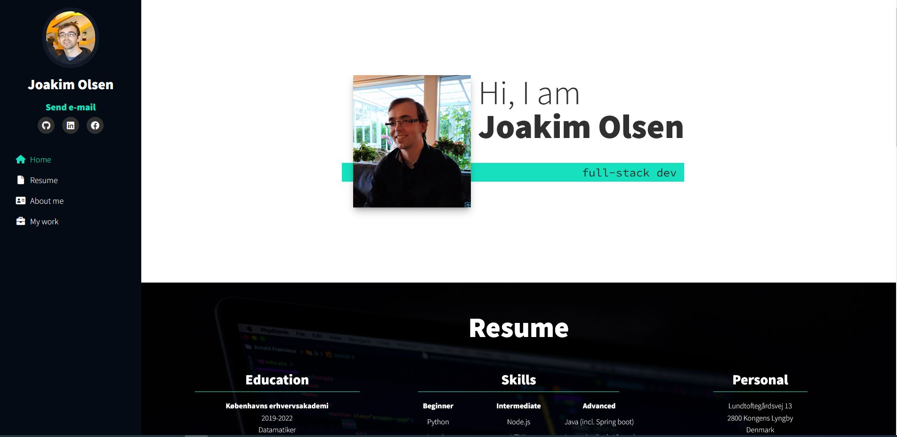
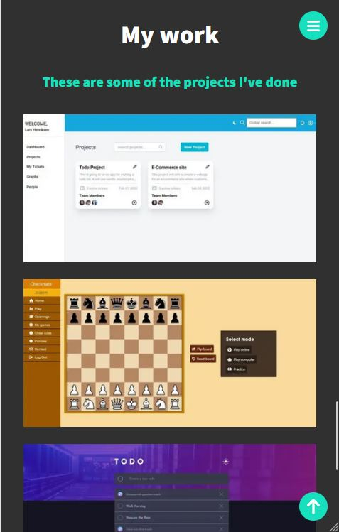

### Features

- Home page with all the different sections
- Project details page for each portfolio item
- Sidebar navigation with active link for the section you're reading
- Responsive layout

### Screenshots

### Links

- Live Site URL: [https://joakim-olsen.netlify.app/](https://joakim-olsen.netlify.app/)

### Built with

- Gatsby
- React
- HTML5
- TailwindCSS
- JavaScript
- GraphQL

### What I learned

It's my first project using the Gatsby framework for React, so everything to do with that was new for me. I also learned about GraphQL for the first time which was interesting. I got another chance to try out React components and improve my capabilities there.
